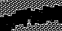
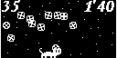

# ArduboyWorks
Making mini games for [Arduboy](https://www.arduboy.com/).

* OBN-Y01 [Hollow Seeker](http://community.arduboy.com/t/hollow-seeker-a-simple-action-game/2594)
  * Go forward in right direction. Seek a hollow as refuge not to be crushed.
  * Depend on Arduboy Library 1.1.1\
     
* OBN-Y02 [Hopper](https://community.arduboy.com/t/hopper-a-simple-action-game/4293)
  * Jump on panels and go up (foreground side). If you fall toward bottom, the game is over.
  * Depend on Arduboy Library 1.1.1\
     
* OBN-Y03 [Chri-Bocchi Cat](https://community.arduboy.com/t/chri-bocchi-cat-a-simple-action-game/4571) for Game Jam 2.0
  * Move the cat and bounce gift boxes for 2 minutes.
  * Depend on Arduboy Library 1.1.1\
     
* OBN-Y04 [Chie Magari Ita](https://community.arduboy.com/t/chie-magari-ita-a-placing-puzzle-game/5178)
  * Place 10 different pieces into the frame without overlapping.
  * Depend on Arduboy Library 1.1.1\
     
