# ArduboyWorks  

Making mini games for [Arduboy](https://www.arduboy.com/).

[My repository information (JSON)](https://obono.github.io/ArduboyWorks/repo.json) \
[Repository viewer](https://obono.github.io/ArduboyWorks/?repo.json)

## Products

* OBN-Y01 [Hollow Seeker](https://community.arduboy.com/t/hollow-seeker-a-simple-action-game/2594)
  * Go forward in right direction. Seek a hollow as refuge not to be crushed.
  * Depends on Arduboy Library 1.1.1\
     
* OBN-Y02 [Hopper](https://community.arduboy.com/t/hopper-a-simple-action-game/4293)
  * Jump on panels and go up (foreground side). If you fall toward bottom, the game is over.
  * Depends on Arduboy Library 1.1.1\
     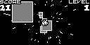
* OBN-Y03 [Chri-Bocchi Cat](https://community.arduboy.com/t/chri-bocchi-cat-a-simple-action-game/4571) (for Game Jam 2.0)
  * Move the cat and bounce gift boxes for 2 minutes.
  * Depends on Arduboy Library 1.1.1\
    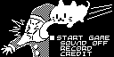 
* OBN-Y04 [Chie Magari Ita](https://community.arduboy.com/t/chie-magari-ita-a-placing-puzzle-game/5178)
  * Place 10 different pieces into the frame without overlapping.
  * Depends on Arduboy Library 1.1.1\
     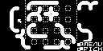
* OBN-Y05 [Psi Colo](https://community.arduboy.com/t/psi-colo-a-puzzle-game-with-dice/6148)
  * A puzzle game with dice on the 5x7 grid field.
  * Depends on Arduboy Library 1.1.1\
    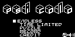 
* OBN-Y06 [Reversi](https://community.arduboy.com/t/reversi-a-simple-board-game/6754)
  * A simple board game.
  * Depends on Arduboy Library 1.1.1\
     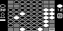
* OBN-Y07 [Lasers](https://community.arduboy.com/t/lasers-a-simple-ikaruga-like-game/7310)
  * Switch the character's color and have it be hit with same color ray.
  * Depends on Arduboy Library 1.1.1\
    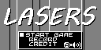 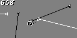
* OBN-Y08 [Quarto!](https://community.arduboy.com/t/quarto-an-abstract-strategy-board-game/8226)
  * A board game played on a 4x4 board with 16 unique pieces.
  * Depends on Arduboy Library 1.1.1\
    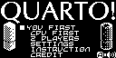 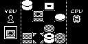
* OBN-Y09 [Stairs Sweep](https://community.arduboy.com/t/stairs-sweep-a-falling-block-puzzle-game/8259)
  * A falling block puzzle game. Boxes lined up horizontally can be deleted. Enemies can not but beaten by a ball.
  * Depends on Arduboy Library 1.1.1\
    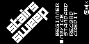 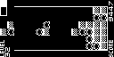
* OBN-Y10 [π 24k](https://community.arduboy.com/t/pi-24k-a-browser-of-circular-constant/8290) (for Game Jam 4.0)
  * A browser of π: circular constant. (24,576 digits)
  * Depends on Arduboy Library 1.1.1\
    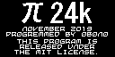 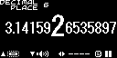
* OBN-Y11 [SameGame](https://community.arduboy.com/t/samegame-a-famous-tile-matching-puzzle/8407)
  * A famous tile-matching puzzle. You can remove a group of adjoining blocks of the same type.
  * Depends on Arduboy Library 1.1.1\
    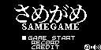 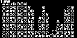
* OBN-Y12 [Knight Move](https://community.arduboy.com/t/knight-move-a-puzzle-platform-game-using-knight/8587)
  * An action puzzle game using a knight piece of the chess.
  * Depends on Arduboy Library 1.1.1\
    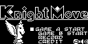 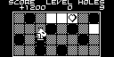
* OBN-Y13 [ARDUBULLETs](https://community.arduboy.com/t/ardubullets-a-short-time-shmups-game/8684)
  * Avoid voluminous bullets and defeat enemy squadron in one minute.
  * Depends on Arduboy2 Library 5.2.1\
     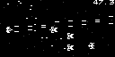
* OBN-Y14 [Evade](https://community.arduboy.com/t/evade-a-simple-action-game/9226) (for Game Jam 5.0)
  * Control the runing guy and evade pillars.
  * Depends on Arduboy2 Library 5.2.1\
     

## License

These codes are licensed under [MIT-License](LICENSE).
